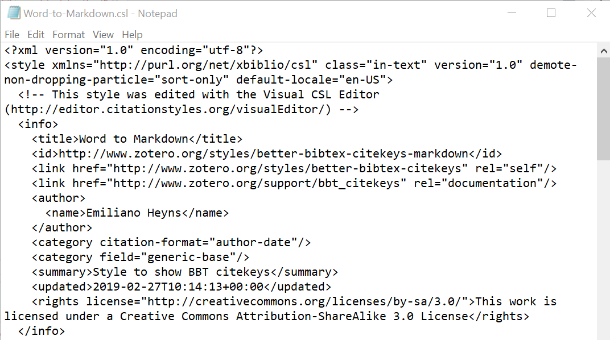
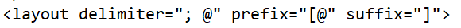
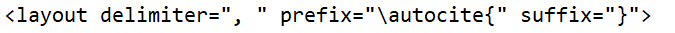

```{r setup, include=FALSE}
options(htmltools.dir.version = FALSE)
library(kableExtra)
```


layout: true 
<!-- without the above layout: true line, there is an empty blank slide at the beginning of the presentation -->

<!-- the following will be the title slide -->
---
name: presentation-title-slide
class: center, middle

# Word to $\LaTeX$ & Markdown

### .fancy[A specific and tedious use-case scenario]

.large[.fancy[Eric Payne]] 

2019-09-26, .small[updated `r Sys.Date()`]

[github.com/eric-m-payne/Word-to-LaTeX](github.com/eric-m-payne/Word-to-LaTeX)


```{r remedy001, echo = F}

icon::fa("desktop")

```

<!-- end title slide -->

---

# Outline

1. Intro
  - $\LaTeX$
  - R Markdown
  - Some advantages and Disadvantages
--
</br>
</br>
2. Converting Word $\rightarrow \LaTeX$
  - Bibliographies
  - Pandoc
  - Tables
--
</br>
</br>
3. Alternative Workflows
</br>
</br>

---
class: center, middle

# 1. Introduction
-----------------

---

## What is $\LaTeX$

- according to https://www.latex-project.org/about/
  - Pronounced “Law-tech” or “Lay-tech”
  - ‘a document preparation system’
     - Used to create pdfs  

--


- Word, LibreOffice Writer == What You See Is What You Get
  - (WYSIWYG, whiz-ee-whig)
  - Documents are printed exactly as you see them on screen

--


- $\LaTeX$ (and Markdown)
  - Documents are written as plain text, but with markup language
  - The computer uses markup language to format document
  - What you see on screen does not match what will be printed

---

## What is $\LaTeX$ $-$ continued

- Bolded  font in Word (PPT, etc) appears as such __Bold bam!__


- Bolded font in $\LaTeX$ (or Markdown) requires command markup
  - `textbf{this is bolded}` will be converted to __this is bolded__
  

- All formatting (e.g., page margins, headers, global document properties) is done via such coding

---

## What is Markdown (and R Markdown)?

+ Similar in concept to $\LaTeX$


+ But produces HTML files instead of PDF upon ‘compilation’
  - this document is in fact an example of this ("Whoaaa...")


+ Multiple flavors of Markdown


+ R Markdown is one such flavor – has been expanded to allow code blocks


+ Note that R Markdown builds on Pandoc’s version of Markdown


---

## $\LaTeX$/Markdown vs WYSIWYG

_Areas where $\LaTeX$ falls short_ (subjective)

|                     | Latex              | WYSIWYG                              |
| :------------------ | :----------------- | :----------------------------------- |
| learning curve      | steep              | easier                               |
| formatting          | can be a pain      | can be a pain                        |
| tables              | enormous hassle    | relatively simpler                   |
| citation management | less sophisticated | convenient integration with managers |


.footnote[If you like LaTeX defaults, then formatting can be quite easy.]


???
If you like Latex defaults, then formatting easier. But difficult when you don't happen to like how Latex formats things.

---

## $\LaTeX$/Markdown vs WYSIWYG

_Areas where $\LaTeX$ excels_ (subjective)

|                                     | Latex                  | WYSIWYG                       |
| :---------------------------------- | :--------------------- | :---------------------------- |
| support for math and chem equations | excellent              | limited                       |
| cross-referencing and auto-numbers  | excellent              | relatively less capable       |
| crashing risk                       | low (plain text files) | high for long or complex docs |
| version control with GIT            | easier b/c plain text  | still possible                |


---


## Why switch from Word to $\LaTeX$ or Markdown?

+ Word document prone to crashing 

--

+ Frequently update tables or figures

--

+ Document includes many equations

--

+ Journal requires Tex document (uncommon)

--

</br>

_Why start with $\LaTeX$ or Markdown to begin with?_

--

- writing includes results, figures, tables that are part of R workflow

--

- want to be able to include code in documents

</br>

--

_Downside_

- Collaboration and track changes difficult


---
class: center, middle

# 2. Converting Word to $\LaTeX$
--------------------------------

---

## Bibliographies in Word, $\LaTeX$, and Markdown

More than you ever wanted to know about citation management.

---

### The issue(s) with Citations

The complication surrounding bibliographies in $\LaTeX$ and Markdown is two-fold. 

--


A) How do citation managers like Zotero, Endnote, Mendeley include citations in Word documents?

--

.center[.large[Magic!]]


--

Pandoc doesn't believe in, or know what to do with, this magic

--

- citations are consequently converted to plain text `r emo::ji("frowning_face")`

--

- so what to do if you need 'active' citations?

--


B) Special formatting changes (i.e., citations with prefixes, suffixes, or suppressed authors create difficulties) 

---

### Citations, Issue A

_Dealing with issue A, plain text citations_

+ $\LaTeX$ and Markdown track citations through bibtex keys

--

+ Mendley and Zotero can both automatically create bibtex keys for each citation in your library

--

+ Essentially, we need a bibliographic style that will show these keys within the Word document text in $\LaTeX$ or Markdown format

--

+ Possible to do this in Zotero and Endnote, but not Mendeley

--

---


### Citations with Zotero
To do so with Zotero (version 5), use [Better Bibtex](https://retorque.re/zotero-better-bibtex/), a super cool tool

--


- Better Bibtex is a bibtex key management system
  - i.e., with it you can assign custom rules for generating citation keys
  - but it contains many more functionalities than just that 

--


- After installing Better Bibtex, it will generate unique citation keys for your library
  - you can change the rules for these keys in Zotero preferences > Better Bibtex > Citation Keys
    - https://retorque.re/zotero-better-bibtex/citing/

--


- Now we need to make these bibtex keys accessible to Zotero reference styles
  - go to Preferences > Advanced > Config Editor
    - Accept the risk
    - Change setting citeprocNoteCitekey to True, which allows the citation keys to be saved within the notes section Zotero references
    
???
There are plans in the future to make it so that Zotero can natively use citation keys in a bibliographic style, but such functionality is currently only implemented through Better Bibtex.

---

### Citations with Zotero

- Now that the bibtex keys are accessible by Zotero, we need to "write" a CSL (Citation Style Language) that will enable Zotero to format our references properly

--


- "Write": the author of Better Bibtex has already written this CSL for us
  - only minor modifications are necessary for Markdown
  
--


- What will this CSL style do?
  - references cited in text as (Spiegel et al. 2016) will be transformed to their $\LaTeX$ or Markdown counterparts $\rightarrow$
    - `\autocite{spiegeletal2016SociallyInteractingIndifferent}`
    - `[@spiegeletal2016SociallyInteractingIndifferent]`

--

- These formatted references will be able to be understood by $\LaTeX$ and Markdown

---

### Citations, Adding the CSL to Zotero 

- To add the provided CSL files to Zotero, navigate to Preferences > Cite > "+" icon
  - select a CSL file from its location
  
--


- Now, you should be able to use these CSL styles as you would any other

--


- What if you want to edit these CSL files?

---


### Citations, Editing CSL styles

- What does CSL code look like?
<!--  -->
<figure>

<figcaption>The header of one of the modified CSL styles.</figcaption>
</figure>
  - notice the `<title>` and `<id>` components
    - I modified these to contain "Word to Markdown" and "better-bitex-citekeys-markdown" respectively 
    - all CSL styles within Zotero require unique labels 

  
<!-- used manual html code for including figure below because pandoc code for controlling figure size {width=50%} didn't work (probably because xaringan doesn't use pandoc) and because knitr::include_graphics screwed up slide title formatting for some reason -->

<!-- <figure> -->
<!--  -->
<!-- <figcaption>The header of one of the modified CSL styles.</figcaption> -->
<!-- </figure> -->


---

### Citations, Editing CSL styles

- What does CSL formatting for Markdown citations look like?

  - the prefix and suffice determines the enclosures of citations, e.g. `[@...]`
  - delimiter determines how citations are separated, e.g., `[@citation 1; @citation2]`
  
--


- What about for $\LaTeX$?

  - here, the delimiter is a "\autocite{}", and uses "," instead of ";"
    - `\autocite{citation1, citation2}`
    - note that "autocite" is part of the `biblatex` citation management package
      - will not be available if you use an alternate package, such as `natbib`

---

### Citations, Using the custom CSL style within Word, Issue B 

- Now that we have the CSL style ready to go, issue B can occur.
  - Ex: `author (year)` becomes `\autocite{citationkey}`. 
    - "Autocite" is not smart enough to read your prose and understand that you want a text citation. 
    - Likewise for the markdown citation format

--


- What to do?
  - Microsoft Visual Basic Applications (VBA)
    - use VBA to write a macro that will convert `author (year)` citations to their correct $\LaTeX$ and Markdown formats (e.g., `\textcite`)
  - to use this Macro, you'll need to add the developer option to your ribbon
      - [see here for a guide](https://www.easytweaks.com/add-show-developer-tab-menu-excel-word-outlook/)
      - right click ribbon > customize ribbon > hit the developer checkbox > OK

--


- Now I can briefly introduce you to the macro
  - or we can skip that
  - Note: the macro only deals with `author (year)` citations and those with prefixes. Cannot handle suffixes or `author (year) + prefix citations` (i.e., `author (user text, year)`)

---

### Citations, using EndNote instead of Zotero

Process for converting EndNote citations is conceptually similar, except we use JabRef as an intermediary

1) From EndNote, export your selected (or all) references to a bibtex format
--


2) Import that file into JabRef and generate citation keys

--


3) Export that Jabref library into 2 files
  - an Endnote txt file (necessary for Word citation conversion)
  - a bibtex file (necessary for citation management in $\LaTeX$ or Markdown)

--


4) Import Endnote txt file into EndNote using a special filter found [here](https://github.com/JabRef/EndNode-JabRef-filters/blob/master/EndNote%20Import%20From%20JabRef.enf)
  - instructions for where to put this EndNote filter [here](https://github.com/JabRef/EndNode-JabRef-filters)
  - may choose to import txt file into a new database
  - for new import, ensure that bibtex keys show up in EndNote "label" field


---

### Citations, Using EndNote instead of Zotero, continued
5) Now make a new EndNote Export style.
  - Edit > Output Styles > Edit *Some style
  - Citations > Templates
  - within "Citation" box, input `\autocite{Label}` for $\LaTeX$ or `[@Label]` for Markdown
  - Change “Citation – Author (Year)” to `\textcite{Label}` for $\LaTeX$ or `[-@]` for Markdown
  - "Multiple citation separator" should be comma for $\LaTeX$ or semicolon for Markdown
  
6) Save this style with some new name

7) Choose that new style within your Word document


Note that there is no modification for prefixes and suffixes, since EndNote citations cannot be user-modified to contain such information


---


## Coming back to Pandoc

- [Pandoc](https://pandoc.org/) is a universal document converter

- R Markdown uses Pandoc to convert markdown to html documents

- but Pandoc can convert a variety of other document types, including `.docx` and `.tex`

- Pandoc is our primary tool for converting Word $\rightarrow$ $\LaTeX$ and Markdown

- now that we know how to deal with citations in Word, how do we use Pandoc?

---

### Using Pandoc

Open a terminal/powershell window in the folder that includes your Word document

- Input the following command 
  - `pandoc --wrap=none my-document.docx -o my-document.tex`
    - this code converts "my-document.docx" to a ".tex" version of the same same
      - don't have to use the same name
      - conversion should produce a markdown document if change ".tex" to ".md"
        - though I haven't tested this


- the code explained
  - `pandoc` calls pandoc.
  - `--wrap=none` prevents lines over 70 something characters from being broken onto new lines, so each paragraph is one line (and will be wrapped in any tex editor). Just a personal preference of mine.
  - the "-o" indicates that pandoc will output to a file
  
  
- there are lots of other options and capabilities within Pandoc. I know none of them; I've basically learned just this one functionality.

---


### After the conversion?

Pandoc conversion of Word document to $\LaTeX$ or Markdown will not be perfect. Example for $\LaTeX$: 

- formatting changes
    - search for and replace all entries of
        - `textbackslash ` with "" (note that there is a trailing space on textbackslash)
	      - `\emph` with `\textit`
	      - `{[}` with `[`	&  `{]}` with `]`
	      - `\{` with `{`  &  `\}` with `}`
  - these formatting changes are necessary due to Pandoc escaping the $\LaTeX$ content that we included within the file. 
	  - an alternative approach would be to copy-paste the word text into $\LaTeX$, but then we would need to manually search for text we knew to be formatted (e.g., bolded text)
- citation changes
    - search for all entries of `textcite` and remove preceding author
- figure changes
  - update includegraphics code to input figures
- table changes
  - update code for tables

???
This is an example for Latex; I haven't converted Word to Markdown myself, but I imagine that similar formatting changes will be necessary.

---

### Table changes ###

- Pandoc likely won't do a good job of formatting your Word tables for $\LaTeX$ or Markdown


- Luckily, if your tables are data-oriented or represent model outputs from R, it's easy to create a version of that table in R
  - using the `kable` function from `knitr` and the accessory package `kableExtra`
  - I won't go through the mechanics here; the kableExtra package has great documentation, but the code is simple enough

```{r remedy002}
data(mtcars)
mtcars[1:4, 1:5] %>% kable(caption = "Some data") %>% kable_styling(bootstrap_options = "basic", position = "float_left") %>% footnote(general = "some footnote text", general_title = "")
```

---

### Table changes, continued

- If your tables contain information that isn't easily manipulated or created in R (e.g., table of text variables)
  - can make the table in Word, Excel, etc
  - copy table
  - paste into R/R markdown document using the [datapasta](https://github.com/MilesMcBain/datapasta) RStudio Addin
  - then print to table with kable and kableExtra

--


- note that table can contain Markdown or $\LaTeX$ markup
  - but only one or other at a time
  - e.g., if want bold text in table for $\LaTeX$, use `\textbf`, but won't work for html documents
  
--


- when producing $\LaTeX$ documents, even kable and kableExtra may not produce exactly the right table
  - I have then used Overleaf.com to test table modifications quickly before implementing them in final document (which may take longer to compile)

---
 
### Table changes, continued

Walk through an example of convering a Word table to $\LaTeX$?

---
class: center, middle

# 3. Alternative Workflows
--------------------------

---

### There must be a better way

- Going from Word to $\LaTeX$ or Markdown (HTML) is obviously not ideal

- Easier to from R Markdown to $\LaTeX$ and HTML

- If you want to write a scientific paper start to finish in R Markdown, the [rticles](https://github.com/rstudio/rticles) package provides a number of templates that can make the process eaisier

- If you want to write your dissertation in R Markdown and ultimately convert to pdf, Ryan Peek developed [aggiedown](https://github.com/ryanpeek/aggiedown), a modification of a package developed by others.
  - caveat: if you don't like the formatting, can be harder to change within aggiedown than just doing it yourself manually within $\LaTeX$

---

### Coming back to citations 
- other (citation) tools that can help in an R-centric workflow
  - the [citr](https://github.com/crsh/citr) or [RefManageR](https://github.com/ropensci/RefManageR) packages
  
    - citr provides a Word-like plugin ability for adding references to an R Markdown document
    
      - it can connect to a Zotero database or another bib file and add citations to the R markdown file from those databases
  
  - with better bibtex, you can also drag and drop (or copy paste) citations from your Zotero library into an R Markdown file as correctly formatted citations (but will need to include a bib file in the yaml header)
---

# other useful R packages


- [docxtractr](https://cran.r-project.org/web/packages/docxtractr/)
  - enables you to extract word tables directly into R. works best with simple tables
  
- [officer](https://cran.r-project.org/web/packages/officer/)
  - enables you to manipulate word documents from within R
  - no experience with this one; I just found it
